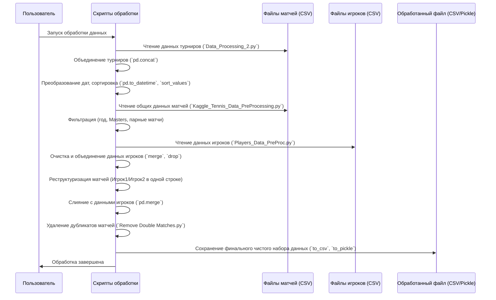

# Chapter 1: Предобработка и сбор данных


Добро пожаловать в руководство по проекту `Tennis-Betting-ML`! Прежде чем мы сможем создавать модели машинного обучения для прогнозирования исходов теннисных матчей, нам нужен надежный фундамент – чистые и хорошо структурированные данные. Эта глава посвящена первому и одному из самых важных шагов: сбору и предварительной обработке данных.

Представьте, что вы детектив, расследующий дело. У вас есть куча разрозненных улик, записок, отчетов из разных источников. Ваша первая задача — собрать всё вместе, отсортировать, убрать ненужное (например, дубликаты или не относящиеся к делу заметки) и сложить в одну аккуратную папку. Только после этого можно приступать к анализу и делать выводы. В нашем проекте "улики" — это данные о теннисных матчах и игроках, а "папка" — это единый, чистый набор данных, готовый для дальнейшей работы.

**Проблема:** Исходные данные о теннисных матчах часто хранятся в разных файлах (например, по одному файлу на турнир), могут содержать ошибки, пропуски, ненужную информацию (например, парные матчи, если мы фокусируемся на одиночных) и дубликаты (один и тот же матч может быть записан дважды – с точки зрения каждого игрока).

**Цель этой главы:** Научиться брать эти "сырые", разрозненные данные, очищать их, объединять и приводить к единому формату, удобному для анализа и построения моделей.

## Основные этапы предобработки

Процесс подготовки данных можно разбить на несколько ключевых этапов:

1.  **Сбор и объединение данных:** Загрузка информации из множества файлов и их слияние в один большой набор данных.
2.  **Фильтрация:** Удаление ненужных записей (например, матчи до 2000 года, парные матчи, турниры низкого уровня).
3.  **Преобразование форматов:** Приведение данных к нужным типам (например, преобразование строк с датами в объекты дат).
4.  **Реструктуризация:** Изменение структуры данных так, чтобы информация об обоих игроках и результате матча находилась в одной строке.
5.  **Обработка данных игроков:** Добавление дополнительной информации об игроках (рука, дата рождения) из отдельных файлов.
6.  **Удаление дубликатов:** Устранение повторяющихся записей о матчах.
7.  **Сохранение результата:** Запись очищенного и структурированного набора данных в новый файл.

Давайте рассмотрим некоторые из этих шагов на примерах кода.

### 1. Сбор и объединение данных турниров

Сначала нам нужно найти все файлы с данными турниров и объединить их. Представим, что все нужные CSV-файлы лежат в одной папке.

```python
import os
import pandas as pd

# Указываем путь к папке с данными турниров
os.chdir(r'C:\Users\PC\Desktop\Kaggle_Tennis\Tournaments_Data') # Замените на ваш путь
cwd = os.getcwd()
files = os.listdir(cwd) # Получаем список всех файлов в папке

# Загружаем первый файл как основу
final_df = pd.read_csv(files[0]) # Берем первый файл для начала

# Проходим по остальным файлам и добавляем их данные к основе
for file in files[1:]: # Начинаем со второго файла
    try:
        temp = pd.read_csv(str(file))
        final_df = pd.concat([final_df, temp], ignore_index=True) # Объединяем
        temp = None # Освобождаем память
    except Exception as e:
        print(f"Не удалось обработать файл {file}: {e}") # Сообщаем об ошибке

# Теперь final_df содержит данные из всех файлов
print(f"Объединено данных из {len(files)} файлов.")
print(final_df.head()) # Посмотрим на первые строки результата
```

**Объяснение:**
*   `os.listdir()` получает список имен всех файлов в указанной директории.
*   Мы читаем первый файл с помощью `pd.read_csv()`.
*   Затем в цикле `for` мы проходим по остальным файлам.
*   `pd.concat()` используется для "склеивания" текущего `final_df` с данными из нового файла (`temp`). `ignore_index=True` нужен, чтобы индексы строк в итоговом DataFrame были последовательными.

### 2. Преобразование дат и сортировка

Данные о датах часто хранятся как строки, но для анализа (например, сортировки по времени) их нужно преобразовать в специальный формат даты.

```python
# Преобразуем столбец 'start_date' в формат даты
# Указываем формат '%Y-%m-%d', если он известен (год-месяц-день)
try:
    final_df['start_date'] = pd.to_datetime(final_df['start_date'], format='%Y-%m-%d')
    # Также можно сделать для 'end_date', если нужно
    # final_df['end_date'] = pd.to_datetime(final_df['end_date'], format='%Y-%m-%d')

    # Сортируем все матчи по дате начала
    final_df = final_df.sort_values(by='start_date')

    print("Даты преобразованы и данные отсортированы.")
    print(final_df[['start_date']].head()) # Показываем первые 5 дат
except KeyError:
    print("Столбец 'start_date' не найден.")
except Exception as e:
    print(f"Ошибка при обработке дат: {e}")
```

**Объяснение:**
*   `pd.to_datetime()` преобразует столбец со строками в объекты `datetime`. Параметр `format` помогает `pandas` правильно распознать формат даты в строке.
*   `sort_values(by='start_date')` упорядочивает все строки DataFrame по возрастанию даты начала матча. Это важно для последующих расчетов, зависящих от времени (например, [Расчет рейтинга ELO](02_расчет_рейтинга_elo_.md)).

### 3. Фильтрация ненужных данных

Не все данные могут быть полезны. Например, нас могут интересовать только матчи после 2000 года, определенного уровня (Masters >= 100) и только одиночные игры.

```python
# Загрузим основной файл с матчами (предположим, он называется all_matches.csv)
# data = pd.read_csv("all_matches.csv") # Пример загрузки

# Фильтруем по году (оставляем матчи с 2000 года и новее)
data_filtered = final_df[final_df['year'] >= 2000].copy()

# Фильтруем по уровню турнира (оставляем Masters >= 100)
# Предположим, столбец называется 'masters'
if 'masters' in data_filtered.columns:
    data_filtered = data_filtered[data_filtered['masters'] >= 100].copy()
else:
    print("Столбец 'masters' не найден для фильтрации.")


# Фильтруем парные матчи (оставляем только одиночные, где 'doubles' == 'f')
# Предположим, столбец называется 'doubles'
if 'doubles' in data_filtered.columns:
    data_filtered = data_filtered[data_filtered['doubles'] == 'f'].copy()
    # Сбрасываем индексы после фильтрации
    data_filtered = data_filtered.reset_index(drop=True)
else:
    print("Столбец 'doubles' не найден для фильтрации.")


print(f"Данные отфильтрованы. Осталось строк: {len(data_filtered)}")
print(data_filtered[['year', 'tournament', 'doubles']].head())
```

**Объяснение:**
*   Мы используем синтаксис `dataframe[условие]`. Например, `data_filtered['year'] >= 2000` создает булеву маску (True/False для каждой строки), и только строки с `True` остаются в DataFrame.
*   `.copy()` используется, чтобы избежать предупреждений `SettingWithCopyWarning` и явно создать новый DataFrame с отфильтрованными данными.
*   `reset_index(drop=True)` обновляет индексы строк после удаления части данных, чтобы они снова шли по порядку (0, 1, 2...).

### 4. Реструктуризация: Объединение данных Игрока 1 и Игрока 2

В исходных данных (`all_matches.csv`) каждый матч представлен двумя строками: одна с точки зрения игрока 1, другая — с точки зрения игрока 2. Наша цель — объединить их в одну строку, содержащую информацию об обоих игроках и результате.

Это сложный шаг, включающий поиск парных записей и перенос статистики второго игрока в столбцы первой записи. Скрипт `Kaggle_Tennis_Data_PreProcessing.py` реализует эту логику. Вместо полного кода (он довольно громоздкий), покажем идею:

**Представьте:**
У нас есть две строки для одного матча:
*   Строка 1: `player_id`=A, `opponent_id`=B, `sets_won`=2, `aces`=10, ...
*   Строка 2: `player_id`=B, `opponent_id`=A, `sets_won`=1, `aces`=5, ...

**Мы хотим получить одну строку:**
*   Строка: `player_id`=A, `opponent_id`=B, `sets_won_1`=2, `aces_1`=10, `sets_won_2`=1, `aces_2`=5, ...

```python
# Псевдокод/Упрощенная идея
# Создаем пустой DataFrame с нужными колонками (player_1_stat, player_2_stat и т.д.)
# final_merged_df = pd.DataFrame(columns=[...колонки для игрока 1..., ...колонки для игрока 2...])

# Для каждой строки 'match_1' в отфильтрованных данных:
#   Находим соответствующую строку 'match_2', где:
#   match_2['player_id'] == match_1['opponent_id'] И
#   match_2['opponent_id'] == match_1['player_id']

#   Если нашли 'match_2':
#     Создаем новую строку в final_merged_df:
#       Копируем общую информацию (дата, турнир) из match_1
#       Копируем статистику игрока 1 из match_1 (в колонки _1)
#       Копируем статистику игрока 2 из match_2 (в колонки _2)
#     Помечаем обе строки (match_1, match_2) как обработанные, чтобы не брать их снова.

# Этот процесс реализован в цикле в скрипте Kaggle_Tennis_Data_PreProcessing.py
print("Идея: объединение парных строк матча в одну.")
```

Этот шаг является центральным в `Kaggle_Tennis_Data_PreProcessing.py` и создает основу для нашего итогового набора данных.

### 5. Удаление дубликатов матчей

Даже после реструктуризации могут остаться дубликаты, если изначальный процесс объединения не был идеальным. Скрипт `Remove Double Matches.py` предназначен для поиска и удаления таких дубликатов уже в *обработанных* файлах (по одному на турнир).

```python
# Функция для удаления дубликатов (из Remove Double Matches.py)
def remove_doubles(data):
    indexes_to_drop = []
    processed_pairs = set() # Хранит пары индексов, которые уже обработаны

    for i in range(len(data)):
        # Ищем строку, где игрок и оппонент поменялись местами
        opponent_id = data.iloc[i]['opponent_id']
        player_id = data.iloc[i]['player_id']

        # Находим индекс(ы) парной строки
        temp_indices = data.index[
            (data['player_id'] == opponent_id) & (data['opponent_id'] == player_id)
        ].tolist()

        if temp_indices:
            j = temp_indices[0] # Берем первый найденный индекс
            # Проверяем, не обработали ли мы уже эту пару (i, j) или (j, i)
            if (i, j) not in processed_pairs and (j, i) not in processed_pairs:
                indexes_to_drop.append(j) # Добавляем индекс второй строки к удалению
                processed_pairs.add((i, j)) # Отмечаем пару как обработанную

    # Удаляем найденные дубликаты
    data = data.drop(index=indexes_to_drop)
    data = data.reset_index(drop=True) # Сбрасываем индексы
    return data

# Пример использования (применяется к каждому файлу турнира отдельно)
# tournament_df = pd.read_csv('some_tournament.csv')
# cleaned_tournament_df = remove_doubles(tournament_df)
# cleaned_tournament_df.to_csv('some_tournament.csv', index=False) # Сохраняем очищенный файл
print("Функция remove_doubles готова к использованию для удаления дубликатов.")

```

**Объяснение:**
*   Функция ищет пары строк, где `player_id` и `opponent_id` просто поменялись местами.
*   Чтобы не удалить обе строки из пары, она добавляет в список `indexes_to_drop` только индекс *второй* найденной строки.
*   Множество `processed_pairs` используется для отслеживания уже обработанных пар, чтобы избежать ошибок.
*   `data.drop()` удаляет строки по их индексам.

### 6. Объединение с данными игроков

Нам также может понадобиться информация об игроках, не содержащаяся в файлах матчей, например, их рабочая рука (`hand`) или дата рождения (`dob`). Эта информация обычно хранится в отдельных файлах (`all_players.csv`, `atp_players.csv`). Скрипты `Players_Data_PreProc.py` и `Players_names_fix.py` занимаются очисткой и объединением этих данных.

```python
# Загрузка данных игроков (пример)
# players_info = pd.read_csv('players_data.csv') # Загруженный и очищенный файл

# Пример слияния с основным датасетом матчей (final_df)
# Предположим, у нас есть final_df с колонками player_id и opponent_id

# Добавляем информацию для player_id
# final_df_with_players = pd.merge(
#     final_df,
#     players_info[['player_id', 'hand', 'dob', 'country']], # Выбираем нужные колонки из players_info
#     on='player_id', # Ключ для слияния
#     how='left' # Оставляем все матчи, даже если игрок не найден
# )

# Переименовываем добавленные колонки
# final_df_with_players = final_df_with_players.rename(columns={
#     'hand': 'hand_1', 'dob': 'dob_1', 'country': 'country_1'
# })

# Добавляем информацию для opponent_id
# final_df_with_players = pd.merge(
#     final_df_with_players,
#     players_info[['player_id', 'hand', 'dob', 'country']],
#     left_on='opponent_id', # Ключ в левом датафрейме
#     right_on='player_id', # Ключ в правом датафрейме (players_info)
#     how='left',
#     suffixes=('', '_2') # Добавляем суффикс _2 к колонкам из players_info
# )
# # Удаляем дублирующую колонку player_id_2
# # final_df_with_players = final_df_with_players.drop(columns=['player_id_2'])

print("Идея: слияние данных матчей с информацией об игроках с помощью pd.merge.")
```

**Объяснение:**
*   `pd.merge()` объединяет два DataFrame на основе общих столбцов (ключей).
*   `on='player_id'` указывает, что слияние происходит по этому столбцу.
*   `left_on` и `right_on` используются, когда ключевые столбцы называются по-разному в двух DataFrame.
*   `how='left'` означает, что все строки из левого DataFrame (`final_df`) сохраняются. Если для какого-то `player_id` нет соответствия в `players_info`, то новые столбцы (`hand`, `dob`...) будут заполнены `NaN` (пропусками).
*   `suffixes` помогает автоматически переименовать одинаковые столбцы (кроме ключевых) при втором слиянии.

## Общая схема процесса

Весь процесс можно представить в виде последовательности шагов:



## Заключение

В этой главе мы рассмотрели основы сбора и предварительной обработки данных для нашего проекта по прогнозированию теннисных матчей. Мы узнали, как:

*   Загружать данные из нескольких файлов и объединять их.
*   Фильтровать ненужные записи.
*   Преобразовывать типы данных, например, даты.
*   Реструктурировать данные, чтобы информация о матче была полной в одной строке.
*   Добавлять дополнительную информацию об игроках.
*   Удалять дубликаты.

Этот этап критически важен, так как качество наших будущих моделей напрямую зависит от качества данных, на которых они обучаются. Теперь, когда у нас есть чистый и структурированный набор данных (`final_df.csv` или аналогичный), мы готовы перейти к следующему шагу.

В следующей главе мы используем эти подготовленные данные для расчета динамического показателя силы каждого игрока — рейтинга ELO.

**Далее:** [Глава 2: Расчет рейтинга ELO](02_расчет_рейтинга_elo_.md)

---

Generated by [AI Codebase Knowledge Builder](https://github.com/The-Pocket/Tutorial-Codebase-Knowledge)