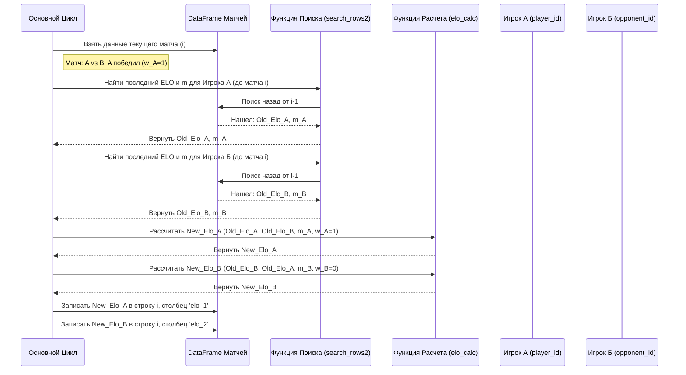

# Chapter 2: Расчет рейтинга ELO


В [предыдущей главе](01_предобработка_и_сбор_данных_.md) мы проделали большую работу: собрали данные о теннисных матчах из разных источников, очистили их от ошибок и дубликатов, и привели всё к единому формату. Теперь у нас есть чистый набор данных (`final_df.csv`), готовый к дальнейшему анализу.

Но просто знать, кто играл и кто выиграл, недостаточно для предсказаний. Нам нужен способ оценить *силу* игроков. И не просто статическую оценку, а такую, которая меняется со временем, отражая текущую форму и опыт игрока. Представьте, что мы хотим предсказать исход матча между Новаком Джоковичем и молодым, перспективным игроком. Нам нужно знать не только их имена, но и насколько силен каждый из них *прямо сейчас*.

Именно для этого мы будем использовать **рейтинг ELO**.

## Что такое рейтинг ELO и зачем он нужен?

**Рейтинг ELO** — это метод расчета относительной силы игроков в играх, где соревнуются двое (как в шахматах или теннисе). Для каждого игрока есть числовой рейтинг. После каждого матча рейтинг обоих игроков обновляется в зависимости от:

1.  **Результата матча:** Победитель получает очки рейтинга, проигравший теряет.
2.  **Рейтингов игроков до матча:** Победа над сильным соперником (с высоким ELO) принесет больше очков, чем победа над слабым. И наоборот, поражение от слабого игрока отнимет больше очков, чем поражение от сильного.

**Аналогия:** Представьте рейтинг ELO как уровень опыта (XP) персонажа в компьютерной игре.
*   Каждый игрок начинает с базового уровня (например, 1500 очков).
*   После каждой "битвы" (матча) опыт изменяется.
*   Победили сильного "монстра" (игрока с высоким ELO)? Получаете много XP!
*   Проиграли слабому "монстру"? Теряете много XP.
*   Со временем, сыграв много матчей, рейтинг игрока стабилизируется и точнее отражает его реальную силу.

**Почему ELO важен для нашего проекта?**
Он дает нам динамическую оценку силы игрока, которая учитывает всю его историю выступлений и силу соперников. Это гораздо информативнее, чем просто официальный рейтинг ATP/WTA, который обновляется реже и по другой системе.

Кроме того, в теннисе очень важно **покрытие корта**. Некоторые игроки великолепны на грунте, но слабее на траве. Поэтому в нашем проекте мы рассчитываем:
*   **Общий рейтинг ELO:** Отражает силу игрока в целом.
*   **Рейтинги ELO для каждого покрытия:** Отдельные рейтинги для грунта (Clay), травы (Grass) и харда (Hard). Это позволяет точнее оценить шансы игроков на конкретном турнире.

## Как рассчитывается ELO? (Основные идеи)

Расчет ELO включает несколько шагов для каждого сыгранного матча между Игроком А и Игроком Б:

1.  **Определяем ожидаемый результат:** Зная текущие рейтинги ELO обоих игроков (скажем, `Elo_A` и `Elo_B`), мы можем рассчитать *ожидаемую долю очков*, которую Игрок А должен набрать в этом матче. Эта доля (назовем ее `P_A`) находится в диапазоне от 0 до 1.
    *   Если `Elo_A` намного выше `Elo_B`, то `P_A` будет близка к 1 (ожидается, что А почти всегда выиграет).
    *   Если `Elo_A` намного ниже `Elo_B`, то `P_A` будет близка к 0 (ожидается, что А почти всегда проиграет).
    *   Если рейтинги равны, `P_A` будет равна 0.5 (шансы равны).
    *   Формула для `P_A`: `1 / (1 + 10^((Elo_B - Elo_A) / 400))`

2.  **Определяем фактический результат:** Это просто — 1 очко, если Игрок А выиграл, и 0 очков, если проиграл. Назовем это `Score_A`.

3.  **Обновляем рейтинг:** Новый рейтинг Игрока А рассчитывается на основе разницы между фактическим и ожидаемым результатом.
    *   Формула обновления: `New_Elo_A = Old_Elo_A + K * (Score_A - P_A)`
    *   `K` — это специальный коэффициент (K-фактор), который определяет, насколько сильно изменится рейтинг.

4.  **K-фактор (Коэффициент обновления):** Этот коэффициент не постоянный.
    *   Для **новичков** (сыгравших мало матчей) `K` больше. Их рейтинг меняется быстрее, так как система еще "не уверена" в их силе.
    *   Для **опытных** игроков (сыгравших много матчей) `K` меньше. Их рейтинг более стабилен и меняется медленнее после каждого матча.
    *   В нашем проекте используется формула, где `K` зависит от `m` (количества сыгранных игроком матчей): `K = 250 / ((5 + m)^0.4)`

Рейтинг Игрока Б обновляется аналогично, но сумма изменений рейтингов А и Б всегда равна нулю (сколько очков получил один, столько же потерял другой).

## Реализация расчета ELO в проекте

Теперь посмотрим, как эти идеи реализованы в коде скрипта `Features_Extraction_ELO_Rankings.py`. Мы будем использовать наш основной DataFrame `matches_df`, который содержит информацию о матчах, отсортированную по дате.

### Шаг 1: Инициализация ELO

Каждый игрок должен с чего-то начать. Мы присваиваем стартовый рейтинг ELO, равный **1500**, каждому игроку перед его *самым первым* зарегистрированным матчем в наших данных.

```python
# Загружаем данные игроков и матчей
players_list = pd.read_csv('players_data_1.csv')['player_id'].tolist()
matches_df = pd.read_csv('final_df.csv') # Загружаем обработанные данные из Главы 1

# Создаем колонки для ELO и заполняем их нулями
matches_df['elo_1'] = 0
matches_df['elo_2'] = 0

# Находим индекс первого матча для каждого игрока
# (Упрощенный цикл для наглядности)
initial_elo_indices_p1 = {} # Словарь для хранения индекса первого матча игрока 1
initial_elo_indices_p2 = {} # Словарь для хранения индекса первого матча игрока 2

for player_id in players_list:
    # Находим все матчи игрока
    player_matches = matches_df[
        (matches_df['player_id'] == player_id) | (matches_df['opponent_id'] == player_id)
    ].sort_values(by='start_date')

    if not player_matches.empty:
        first_match_index = player_matches.index[0]
        first_match = player_matches.iloc[0]
        # Запоминаем, в какой колонке (игрок 1 или 2) он был в первом матче
        if first_match['player_id'] == player_id:
            initial_elo_indices_p1[first_match_index] = 1500
        else: # Игрок был opponent_id
            initial_elo_indices_p2[first_match_index] = 1500

# Присваиваем стартовый ELO 1500 в найденных ячейках
for index, value in initial_elo_indices_p1.items():
    matches_df.at[index, 'elo_1'] = value
for index, value in initial_elo_indices_p2.items():
    matches_df.at[index, 'elo_2'] = value

print("Начальные ELO установлены для первых матчей игроков.")
print(matches_df.loc[matches_df['elo_1'] == 1500, ['player_id', 'opponent_id', 'elo_1', 'elo_2']].head())
```

**Объяснение:**
*   Мы создаем новые столбцы `elo_1` и `elo_2` в нашем DataFrame `matches_df`.
*   Затем для каждого игрока из списка `players_list` мы находим его самый ранний матч (помните, данные отсортированы по дате).
*   В строке этого первого матча мы устанавливаем ELO игрока (либо в `elo_1`, либо в `elo_2`, в зависимости от того, был он `player_id` или `opponent_id`) равным 1500. Все остальные ячейки ELO пока остаются 0.

### Шаг 2: Расчет количества сыгранных матчей (`m`)

Для вычисления K-фактора нам нужно знать, сколько матчей (`m`) игрок сыграл *до* текущего матча. Это делается заранее для всех матчей и сохраняется во вспомогательном DataFrame (`copy` в коде) или вычисляется на лету.

```python
# Вспомогательная функция для подсчета предыдущих матчей игрока
def get_m(player_id, data, current_match_index):
    # Выбираем все строки до текущего матча
    previous_matches = data.iloc[:current_match_index]
    # Считаем, сколько раз игрок встречался (как player_id или opponent_id)
    count = previous_matches[
        (previous_matches['player_id'] == player_id) | (previous_matches['opponent_id'] == player_id)
    ].shape[0]
    return count

# Пример использования (в реальном коде это делается в цикле для всех)
# m_player1 = get_m(matches_df.iloc[100]['player_id'], matches_df, 100)
# m_player2 = get_m(matches_df.iloc[100]['opponent_id'], matches_df, 100)
# print(f"Пример: Игрок 1 сыграл {m_player1} матчей до индекса 100.")
# print(f"Пример: Игрок 2 сыграл {m_player2} матчей до индекса 100.")
print("Функция get_m готова для подсчета сыгранных матчей.")

# В скрипте эти значения рассчитываются для всех и сохраняются
# copy['m_1'] = ... # m для player_id
# copy['m_2'] = ... # m для opponent_id
```

**Объяснение:**
*   Функция `get_m` принимает ID игрока, весь DataFrame и индекс *текущего* матча.
*   Она смотрит на все матчи *до* текущего (`data.iloc[:current_match_index]`).
*   Затем считает, сколько раз в этих прошлых матчах появлялся наш `player_id`. Это и есть значение `m`.

### Шаг 3: Поиск предыдущего ELO

Перед расчетом ELO для текущего матча нам нужно знать *последний* известный ELO каждого из игроков. Поскольку игрок мог пропустить несколько турниров, его последний ELO может быть не в предыдущей строке DataFrame, а где-то раньше.

Скрипт использует оптимизированную функцию `search_rows2` для быстрого поиска этого значения, просматривая данные назад с увеличивающимися "шагами".

```python
# Идея функции поиска последнего ELO (упрощенно)
# (Реальная функция search_rows2 сложнее для оптимизации)
def find_last_elo(player_id, data, current_match_index):
    last_known_elo = 1500 # По умолчанию - стартовый ELO
    m_count = 0 # По умолчанию - 0 матчей
    actual_result = 0 # Результат того матча (нужен для формулы)

    # Идем НАЗАД от текущего матча (не включая его)
    for k in range(current_match_index - 1, -1, -1):
        row = data.iloc[k]
        # Если нашли матч с участием нашего игрока...
        if row['player_id'] == player_id:
            if row['elo_1'] != 0: # ...и его ELO уже был рассчитан (не 0)
                last_known_elo = row['elo_1']
                # m_count = row['m_1'] # Получаем кол-во матчей на тот момент
                # actual_result = 1 if row['player_1_victory'] == 't' else 0
                break # Нашли - выходим из цикла
        elif row['opponent_id'] == player_id:
            if row['elo_2'] != 0:
                last_known_elo = row['elo_2']
                # m_count = row['m_2']
                # actual_result = 1 if row['player_2_victory'] == 't' else 0
                break
    # Функция в скрипте возвращает m, last_elo, victory
    return m_count, last_known_elo, actual_result

# print("Функция find_last_elo (идея search_rows2) готова.")
print("Идея функции search_rows2: найти последний известный ELO игрока, двигаясь назад по таблице.")

```

**Объяснение:**
*   Функция ищет *последнюю* строку *до текущей*, где участвовал `player_id` и где его ELO уже был рассчитан (не равен 0 или начальному 1500, если он еще не был рассчитан).
*   Она возвращает найденный ELO и количество матчей (`m`), которое было у игрока *на момент того матча*. Это важно для K-фактора.

### Шаг 4: Функция расчета ELO

Эта функция реализует саму формулу обновления ELO.

```python
import numpy as np

def elo_calc(elo_a, elo_b, m_a, w_a):
    # elo_a: Текущий ELO игрока A
    # elo_b: Текущий ELO игрока B
    # m_a:   Количество матчей, сыгранных игроком A *до этого матча*
    # w_a:   Результат матча для игрока A (1 - победа, 0 - поражение)

    # 1. Рассчитать ожидаемый результат для A
    expected_pi_a = 1.0 / (1 + 10**((elo_b - elo_a) / 400))

    # 2. Рассчитать K-фактор для A
    # Используем m_a (количество матчей ДО этого)
    decay_k = 250.0 / ((5 + m_a)**0.4)

    # 3. Обновить ELO для A
    updated_elo_a = elo_a + decay_k * (w_a - expected_pi_a)

    return updated_elo_a

# Пример
# new_elo = elo_calc(elo_a=1600, elo_b=1500, m_a=50, w_a=1) # Игрок А выиграл
# print(f"Пример расчета: Новый ELO = {new_elo}")
print("Функция elo_calc реализует формулу обновления ELO.")
```

**Объяснение:**
*   Функция точно следует формулам, описанным ранее.
*   Она принимает текущие ELO обоих игроков (`elo_a`, `elo_b`), количество предыдущих матчей игрока А (`m_a`) и результат матча для игрока А (`w_a`).
*   Возвращает новое, обновленное значение ELO для игрока А.

### Шаг 5: Основной цикл расчета

Теперь мы объединяем все шаги. Мы проходим по всем матчам в хронологическом порядке (начиная со второго, так как для первого ELO уже инициализирован или будет взят как 1500).

```python
# Упрощенный основной цикл расчета ELO
# В реальном коде используется вспомогательный DataFrame 'copy' для оптимизации

# Проходим по всем строкам DataFrame (матчам)
for i in range(len(matches_df)):
    # Если ELO для игрока 1 в этом матче еще не рассчитан (равен 0)...
    if matches_df.at[i, 'elo_1'] == 0:
        player_1_id = matches_df.iloc[i]['player_id']
        player_2_id = matches_df.iloc[i]['opponent_id']

        # Находим последний ELO и m для обоих игроков ДО этого матча
        # Используем оптимизированную функцию search_rows2
        m_1, last_elo_1, _ = search_rows2(i, player_1_id, matches_df) # Вспом. ф-ция из скрипта
        m_2, last_elo_2, _ = search_rows2(i, player_2_id, matches_df)

        # Если ELO не найден (первый матч), используем 1500
        if last_elo_1 is None: last_elo_1 = 1500
        if last_elo_2 is None: last_elo_2 = 1500

        # Определяем результат для игрока 1 (1 или 0)
        w_1 = 1 if matches_df.iloc[i]['player_1_victory'] == 't' else 0

        # Рассчитываем новый ELO для игрока 1
        new_elo_1 = elo_calc(last_elo_1, last_elo_2, m_1, w_1)
        matches_df.at[i, 'elo_1'] = new_elo_1 # Записываем в DataFrame

    # Аналогично для игрока 2 (opponent_id)
    if matches_df.at[i, 'elo_2'] == 0:
        player_1_id = matches_df.iloc[i]['player_id']
        player_2_id = matches_df.iloc[i]['opponent_id']

        m_1, last_elo_1, _ = search_rows2(i, player_1_id, matches_df)
        m_2, last_elo_2, _ = search_rows2(i, player_2_id, matches_df)

        if last_elo_1 is None: last_elo_1 = 1500
        if last_elo_2 is None: last_elo_2 = 1500

        # Результат для игрока 2
        w_2 = 1 if matches_df.iloc[i]['player_2_victory'] == 't' else 0

        # Рассчитываем новый ELO для игрока 2
        new_elo_2 = elo_calc(last_elo_2, last_elo_1, m_2, w_2) # Порядок elo важен!
        matches_df.at[i, 'elo_2'] = new_elo_2

    # Периодически выводим прогресс
    if i % 10000 == 0:
        print(f"Обработано матчей: {i}")

print("Расчет общего ELO завершен.")
# matches_df.to_csv('final_df_with_elo.csv') # Сохраняем результат
```

**Объяснение:**
*   Цикл `for i in range(len(matches_df))` проходит по каждой строке (матчу).
*   Внутри он проверяет, рассчитан ли уже ELO для `player_id` (`elo_1`) и `opponent_id` (`elo_2`) в *этой* строке. Он будет равен 0, если это первый матч для данного игрока после его инициализации (или если инициализация произошла в этой же строке).
*   Если ELO равен 0, он вызывает `search_rows2`, чтобы найти *предыдущий* ELO и количество матчей (`m`) для обоих игроков.
*   Затем он вызывает `elo_calc`, передавая найденные значения и результат текущего матча (`w_1` или `w_2`).
*   Полученный новый ELO записывается в соответствующую ячейку (`elo_1` или `elo_2`) текущей строки `i`.
*   Таким образом, к моменту обработки следующего матча `i+1`, ELO для матча `i` уже будут рассчитаны и могут быть использованы функцией `search_rows2`.

## Расчет ELO для разных покрытий корта

Как мы упоминали, сила игрока может сильно зависеть от покрытия корта (грунт, хард, трава). Чтобы учесть это, скрипт повторяет весь описанный выше процесс расчета ELO трижды, но каждый раз использует только подмножество матчей, сыгранных на определенном покрытии.

1.  **Фильтрация:** Создаются три временных DataFrame: `copy_clay`, `copy_hard`, `copy_grass`, содержащие только матчи на соответствующем покрытии. Столбец 'Carpet' (ковер) предварительно объединяется с 'Grass' (трава), так как они похожи.
2.  **Инициализация:** Для каждого из этих трех DataFrame выполняется инициализация ELO (установка 1500 для первого матча *на этом покрытии*) в новые столбцы (`elo_1_clay`, `elo_2_clay` и т.д.).
3.  **Расчет `m` для покрытия:** Рассчитывается количество матчей `m`, сыгранных игроком *только на этом покрытии*.
4.  **Расчет ELO для покрытия:** Запускается основной цикл расчета ELO (аналогичный общему, но с использованием адаптированных функций поиска `search_rows2_clay` и т.д.), который вычисляет и обновляет ELO в столбцах `elo_1_clay`, `elo_2_clay` и т.д. внутри временных DataFrame.
5.  **Объединение результатов:** Полученные значения ELO для каждого покрытия переносятся из временных DataFrame (`copy_clay`...) обратно в основной `matches_df` в соответствующие строки и столбцы (`elo_1_clay`, `elo_2_hard` и т.д.).
6.  **Создание общего столбца `elo_surface`:** Наконец, создаются два итоговых столбца: `elo_1_surface` и `elo_2_surface`. Для каждой строки (матча) значение в `elo_1_surface` берется из соответствующего столбца покрытия (`elo_1_clay`, `elo_1_hard` или `elo_1_grass`), в зависимости от того, на каком покрытии игрался данный матч.

```python
# Шаг 1: Фильтрация (Пример для Clay)
copy_clay = matches_df[matches_df['court_surface'] == 'Clay'].copy()
copy_clay.reset_index(inplace=True) # Сброс индекса важен для работы iloc

# Шаг 2: Инициализация ELO для Clay (аналогично общей)
copy_clay['elo_1_clay'] = 0
copy_clay['elo_2_clay'] = 0
# ... код инициализации 1500 для clay ...
print("Создан DataFrame и инициализирован ELO для грунта (Clay).")

# Шаг 3 и 4: Расчет m_clay и ELO_clay (аналогично общему, но на copy_clay)
# ... расчет m_1_clay, m_2_clay ...
# ... цикл расчета с search_rows2_clay и elo_calc ...
print("Рассчитан ELO для грунта.")

# Шаг 5: Перенос результатов в основной DataFrame (Пример для Clay)
# Добавляем пустые колонки в matches_df, если их нет
if 'elo_1_clay' not in matches_df.columns:
    matches_df['elo_1_clay'] = 0.0 # Используем float для ELO
    matches_df['elo_2_clay'] = 0.0

# Проходим по copy_clay и записываем ELO в matches_df по исходному индексу
for i in range(len(copy_clay)):
    original_index = copy_clay.iloc[i]['index'] # Исходный индекс из matches_df
    matches_df.at[original_index, 'elo_1_clay'] = copy_clay.iloc[i]['elo_1_clay']
    matches_df.at[original_index, 'elo_2_clay'] = copy_clay.iloc[i]['elo_2_clay']

print("Результаты ELO для грунта перенесены в основной DataFrame.")

# Повторить шаги 1-5 для Hard и Grass...

# Шаг 6: Создание итоговых столбцов elo_surface
matches_df['elo_1_surface'] = 0.0
matches_df['elo_2_surface'] = 0.0

for i in range(len(matches_df)):
    surface = matches_df.iloc[i]['court_surface']
    if surface == 'Clay':
        matches_df.at[i, 'elo_1_surface'] = matches_df.iloc[i]['elo_1_clay']
        matches_df.at[i, 'elo_2_surface'] = matches_df.iloc[i]['elo_2_clay']
    elif surface == 'Hard':
        matches_df.at[i, 'elo_1_surface'] = matches_df.iloc[i]['elo_1_hard']
        matches_df.at[i, 'elo_2_surface'] = matches_df.iloc[i]['elo_2_hard']
    elif surface == 'Grass': # Включая Carpet
        matches_df.at[i, 'elo_1_surface'] = matches_df.iloc[i]['elo_1_grass']
        matches_df.at[i, 'elo_2_surface'] = matches_df.iloc[i]['elo_2_grass']

print("Созданы итоговые столбцы ELO для конкретного покрытия матча.")
print(matches_df[['court_surface', 'elo_1_clay', 'elo_1_hard', 'elo_1_grass', 'elo_1_surface']].head())

```

**Объяснение:**
*   Сначала мы создаем копию данных только для одного покрытия (например, `copy_clay`).
*   Затем мы выполняем *весь* процесс расчета ELO (инициализация, расчет `m`, поиск, основной цикл) только на этой копии, записывая результаты в специфичные для покрытия столбцы (`elo_1_clay`).
*   После расчета для одного покрытия, мы переносим эти значения ELO обратно в *основной* DataFrame `matches_df`, используя исходные индексы строк, которые мы сохранили при создании копии.
*   Этот процесс повторяется для Hard и Grass.
*   Наконец, мы создаем "умные" столбцы `elo_1_surface` и `elo_2_surface`, которые для каждого матча содержат ELO, рассчитанное именно для того покрытия, на котором этот матч игрался.

## Визуализация процесса обновления ELO

Представим, как обновляется ELO для одного матча:



Эта диаграмма показывает шаги: получение данных матча, поиск предыдущих рейтингов и числа игр для обоих игроков, вызов функции расчета для каждого и, наконец, обновление DataFrame новыми значениями ELO для текущего матча.

## Заключение

В этой главе мы погрузились в мир рейтинга ELO. Мы узнали:

*   **Что такое ELO:** Динамическая система оценки относительной силы игроков.
*   **Почему он важен:** Дает изменяющуюся во времени оценку формы игрока, учитывая силу соперников.
*   **Как он рассчитывается:** На основе ожидаемого и фактического исхода матча, с использованием K-фактора, зависящего от опыта игрока.
*   **Как он реализован в проекте:** Через инициализацию, поиск предыдущих значений и итеративный расчет по всем матчам.
*   **Важность ELO для разных покрытий:** Как рассчитываются отдельные рейтинги для Clay, Hard и Grass для более точной оценки.

Теперь наш DataFrame `matches_df` обогатился новыми, очень важными признаками: общим ELO (`elo_1`, `elo_2`) и ELO, специфичным для покрытия матча (`elo_1_surface`, `elo_2_surface`). Эти числовые показатели силы игроков станут ключевыми компонентами для построения нашей модели машинного обучения.

В следующей главе мы продолжим создавать новые признаки на основе имеющихся данных и применим метод PCA для уменьшения размерности и выбора наиболее важных характеристик.

**Далее:** [Глава 3: Создание признаков и PCA](03_создание_признаков_и_pca_.md)

---

Generated by [AI Codebase Knowledge Builder](https://github.com/The-Pocket/Tutorial-Codebase-Knowledge)