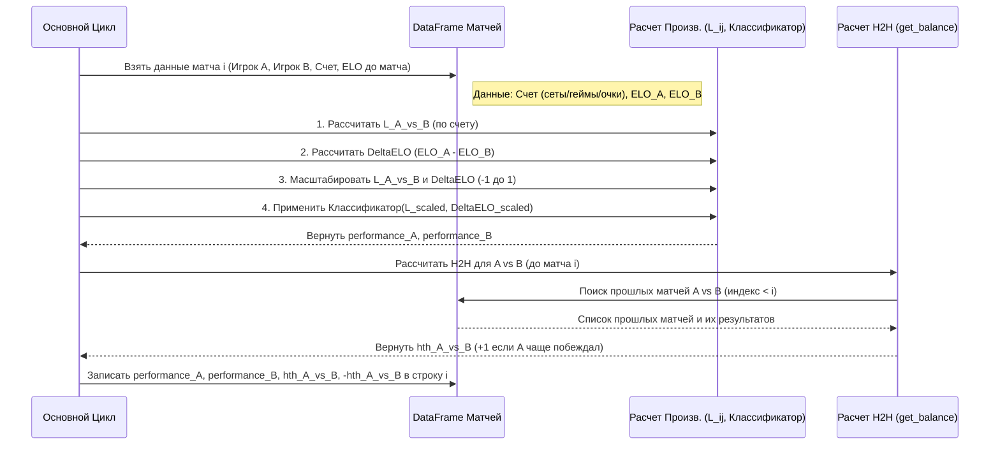

# Chapter 4: Оценка производительности и H2H


В [предыдущей главе](03_создание_признаков_и_pca_.md) мы научились создавать новые, полезные признаки из "сырой" статистики матчей и использовать Метод Главных Компонент (PCA) для сжатия информации о подаче и приеме в компактные рейтинги (`service_pca`, `return_pca`). Вместе с [рейтингом ELO](02_расчет_рейтинга_elo_.md), это дает нам хорошее представление об общей силе и некоторых аспектах игры теннисистов.

Но достаточно ли этого? Представьте: два игрока с почти одинаковым ELO и похожими PCA-рейтингами играют друг против друга. Как предсказать исход? Возможно, один из них исторически очень плохо играет именно против этого соперника? Или, может быть, один из них выиграл свой предыдущий матч, но сделал это крайне неубедительно, чудом "отскочив" от поражения?

**Проблема:** Общие рейтинги (ELO, PCA) не всегда отражают:
1.  Насколько *хорошо* или *плохо* игрок выступил в конкретном, последнем матче относительно ожиданий (основанных на разнице в силе с соперником).
2.  Как исторически складываются отношения между двумя *конкретными* игроками (кто кого чаще побеждает в личных встречах).

**Цель этой главы:** Научиться вычислять две важные группы метрик:
*   **Оценка производительности (Performance Score):** Численный показатель того, насколько результат конкретного матча (счет по сетам, геймам, очкам) соответствует или превосходит ожидания, основанные на разнице в рейтингах ELO.
*   **Баланс личных встреч (Head-to-Head, H2H):** Простой подсчет побед и поражений между двумя конкретными игроками в их предыдущих матчах.

Эти метрики добавят важный контекст к нашим данным, помогая модели лучше понимать нюансы формы игрока и специфику противостояний.

## 1. Оценка производительности: Насколько хорошо игрок выступил?

Идея проста: мы хотим оценить не просто победу или поражение, а *качество* этой победы или поражения. Выиграть у сильного соперника со счетом 6-0, 6-0 — это выдающееся выступление. Проиграть равному сопернику в упорной борьбе 6-7, 7-6, 6-7 — это не так уж плохо.

### Шаг 1: Метрика доминирования (`L_ij`)

Сначала нам нужна метрика, которая объединит счет по сетам, геймам и очкам в одно число, отражающее, насколько один игрок (`i`) доминировал над другим (`j`) в данном матче. В проекте используется формула:

`L_ij = (сэты_i - сэты_j) + (геймы_i - геймы_j) / 6 + (очки_i - очки_j) / 24`

Где:
*   `сэты_i`, `геймы_i`, `очки_i` — сэты, геймы, очки, выигранные игроком `i`.
*   `сэты_j`, `геймы_j`, `очки_j` — сэты, геймы, очки, выигранные игроком `j`.

**Интуиция:** Разница в сетах имеет наибольший вес. Разница в геймах — меньший (примерно 1/6 от сета). Разница в очках — еще меньший (примерно 1/4 от гейма, или 1/24 от сета). Положительное значение `L_ij` означает, что игрок `i` выиграл и доминировал в матче, отрицательное — что проиграл. Чем больше абсолютное значение, тем более односторонним был матч.

В коде (`Feature_Extraction_Performance.py`) это рассчитывается очень эффективно для всего DataFrame:

```python
# Расчет L_ij для игрока 1 (насколько игрок 1 доминировал над игроком 2)
matches_df['l_ij'] = (matches_df['sets_won_1'] - matches_df['sets_won_2'] +
                      (matches_df['games_won_1'] - matches_df['games_won_2']) / 6 +
                      (matches_df['total_points_won_1'] - matches_df['total_points_won_2']) / 24)

# Расчет L_ji для игрока 2 (насколько игрок 2 доминировал над игроком 1)
# Это просто L_ij с обратным знаком
matches_df['l_ji'] = -matches_df['l_ij']

# Обработка случаев, где нет данных по очкам (используем только сеты и геймы)
# (Код в скрипте обрабатывает возможные NaN значения в очках)

print("Рассчитаны метрики доминирования l_ij и l_ji:")
print(matches_df[['player_id', 'opponent_id', 'l_ij']].head())
```

**Объяснение:**
*   Мы создаем два новых столбца `l_ij` и `l_ji`.
*   `l_ij` рассчитывается по формуле выше, используя данные из существующих столбцов.
*   `l_ji` просто берется как `-l_ij`, так как доминирование второго игрока обратно доминированию первого.
*   Скрипт также включает логику для обработки матчей, где данные об общем количестве выигранных очков (`total_points_won`) могут отсутствовать (`NaN`). В таких случаях используется урезанная формула только с сетами и геймами.

### Шаг 2: Учет силы соперника (Разница ELO)

Значение `L_ij` показывает *насколько* игрок выиграл или проиграл, но не учитывает, *у кого* он выиграл или проиграл. Чтобы понять, было ли выступление *лучше* или *хуже* ожиданий, нам нужно сравнить `L_ij` с разницей в рейтингах ELO между игроками перед матчем.

`delta_elo = elo_1 - elo_2` (где `elo_1` и `elo_2` - это [рейтинги ELO](02_расчет_рейтинга_elo_.md) игроков *до* начала матча).

### Шаг 3: Масштабирование

Сравнивать `L_ij` (который может иметь разный диапазон значений) и `delta_elo` (который тоже может варьироваться) напрямую неудобно. Поэтому мы масштабируем оба значения к единому диапазону, например, от -1 до 1, используя `MinMaxScaler`.

```python
from sklearn.preprocessing import MinMaxScaler
import numpy as np

# Рассчитываем разницу ELO
matches_df['delta_elo'] = matches_df['elo_1'] - matches_df['elo_2']

# Создаем объект MinMaxScaler для масштабирования в диапазон [-1, 1]
scaler = MinMaxScaler(feature_range=(-1, 1))

# Масштабируем delta_elo
# .reshape(-1, 1) нужен, так как scaler ожидает 2D-массив
matches_df['delta_elo_scaled'] = scaler.fit_transform(np.array(matches_df['delta_elo']).reshape(-1, 1))

# Масштабируем l_ij
matches_df['l_ij_scaled'] = scaler.fit_transform(np.array(matches_df['l_ij']).reshape(-1, 1))
# Масштабируем l_ji
matches_df['l_ji_scaled'] = scaler.fit_transform(np.array(matches_df['l_ji']).reshape(-1, 1))

print("Масштабированные значения (первые 5 строк):")
print(matches_df[['delta_elo_scaled', 'l_ij_scaled']].head())
```

**Объяснение:**
*   Мы рассчитываем `delta_elo`.
*   Создаем `MinMaxScaler`, который преобразует минимальное значение в столбце в -1, максимальное в 1, а остальные значения распределит между ними.
*   Применяем `fit_transform` к столбцам `delta_elo`, `l_ij` и `l_ji` для получения их масштабированных версий.

### Шаг 4: Классификатор производительности ("Шахматная доска")

Теперь у нас есть два масштабированных показателя для каждого матча (с точки зрения игрока 1):
*   `delta_elo_scaled`: Насколько игрок 1 был сильнее (ближе к 1) или слабее (ближе к -1) игрока 2 по ELO.
*   `l_ij_scaled`: Насколько доминирующей была победа (ближе к 1) или разгромным поражение (ближе к -1) игрока 1.

Мы можем представить эти два показателя как оси на графике. Наша цель — разделить эту "карту" на регионы, каждый из которых соответствует определенному уровню производительности. Функция `classify_performance` в скрипте делает именно это, работая как набор `if/elif` правил.

**Аналогия "Шахматная доска":**
Представьте доску, где по горизонтали отложена разница ELO (от "намного слабее" до "намного сильнее"), а по вертикали — результат матча (от "разгромное поражение" до "уверенная победа").
*   **Верхний правый угол:** Вы намного сильнее и уверенно выиграли (ожидаемый результат, средняя производительность, например, +1 балл).
*   **Верхний левый угол:** Вы намного слабее, но сенсационно выиграли (выдающаяся производительность, например, +10 баллов).
*   **Нижний правый угол:** Вы намного сильнее, но умудрились проиграть (ужасная производительность, например, -10 баллов).
*   **Нижний левый угол:** Вы намного слабее и проиграли (ожидаемый результат, средняя/низкая производительность, например, -1 балл).

Функция `classify_performance` реализует эту логику, присваивая числовой балл (от -10 до +10) каждому матчу в зависимости от комбинации `delta_elo_scaled` и `l_ij_scaled` (или `l_ji_scaled` для второго игрока).

```python
# (Функция classify_performance(l, elo) определена в скрипте)
# Она содержит много if/elif для разных диапазонов l и elo

# Применяем классификатор к каждой строке
matches_df['performance_1'] = 0
matches_df['performance_2'] = 0
# Создаем масштабированную разницу ELO для второго игрока
matches_df['delta_elo_scaled_2'] = -matches_df['delta_elo_scaled']

for i in range(len(matches_df)):
    # Пропускаем, если уже рассчитано (оптимизация в скрипте)
    if matches_df.iloc[i]['performance_1'] != 0:
        continue
    
    l1 = matches_df.iloc[i]['l_ij_scaled']
    elo1 = matches_df.iloc[i]['delta_elo_scaled']
    matches_df.at[i, 'performance_1'] = classify_performance(l1, elo1)
    
    l2 = matches_df.iloc[i]['l_ji_scaled']
    elo2 = matches_df.iloc[i]['delta_elo_scaled_2'] # Используем обратную разницу ELO
    matches_df.at[i, 'performance_2'] = classify_performance(l2, elo2)
    
    # Печать прогресса (в оригинальном скрипте)
    # print('iteration number : ',i,' of ',len(matches_df))

print("Рассчитаны оценки производительности:")
print(matches_df[['player_id', 'opponent_id', 'delta_elo_scaled', 'l_ij_scaled', 'performance_1']].head())
```

**Объяснение:**
*   Мы создаем столбцы `performance_1` и `performance_2`.
*   В цикле для каждой строки мы берем масштабированные `l` и `elo` для каждого игрока.
*   Вызываем функцию `classify_performance`, которая возвращает оценку производительности на основе "шахматной доски".
*   Записываем результат в соответствующие столбцы.

Теперь у нас есть числовая оценка (`performance_1`, `performance_2`), которая показывает, насколько хорошо каждый игрок выступил в данном матче *относительно ожиданий*, основанных на их силе (ELO).

**Примечание:** В скрипте `Feature_Extraction_Performance.py` далее рассчитывается [Скользящее среднее (EMA) для формы игрока](05_скользящее_среднее__ema__для_формы_игрока_.md) на основе этих оценок производительности (`performance_1_ema`, `performance_2_ema`), чтобы получить сглаженную оценку недавней формы. Мы подробнее рассмотрим EMA в следующей главе.

## 2. Баланс личных встреч (Head-to-Head, H2H)

Второй важный аспект — история противостояний между двумя конкретными игроками. Некоторые игроки могут иметь высокий рейтинг ELO, но постоянно проигрывать определенному сопернику из-за неудобного стиля игры. H2H помогает уловить такие закономерности.

**Концепция:** Для каждого матча между Игроком А и Игроком Б мы хотим знать, каков был счет их личных встреч *до* этого матча. Например, если до текущего матча они играли 5 раз, и Игрок А выиграл 3 раза, а Игрок Б — 2 раза, то H2H с точки зрения Игрока А будет `+1` (3 победы - 2 поражения). С точки зрения Игрока Б H2H будет `-1`.

**Аналогия:** Представьте игру "камень-ножницы-бумага". Камень силен против ножниц, но слаб против бумаги. H2H показывает, кто чаще был "камнем", а кто "бумагой" в предыдущих встречах этой конкретной пары.

### Реализация в коде

Скрипт `Features_Extraction_Head_To_Head_Balance.py` реализует это с помощью функции `get_balance`, которая вызывается для каждого матча.

```python
# Вспомогательные столбцы: 1 если игрок выиграл, 0 если проиграл
matches_df['player_1_v'] = matches_df['player_1_victory'].apply(lambda x: 1 if x == 't' else 0)
matches_df['player_2_v'] = matches_df['player_2_victory'].apply(lambda x: 1 if x == 't' else 0)

# Функция для расчета H2H баланса до текущего матча
def get_balance(row_index, player, opponent, data):
    # Выбираем все матчи ДО текущего (индекс < row_index)
    temp = data.iloc[:row_index] 
    # Фильтруем только матчи между этими двумя игроками
    temp = temp.loc[((temp['player_id'] == player) & (temp['opponent_id'] == opponent)) |
                    ((temp['player_id'] == opponent) & (temp['opponent_id'] == player))]
    
    # Если предыдущих встреч не было, баланс 0
    if len(temp) == 0:
        return 0
    
    balance = 0
    # Считаем баланс с точки зрения 'player'
    for i in range(len(temp)):
        if temp.iloc[i]['player_id'] == player: # 'player' был player_id в том матче
            balance += 1 if temp.iloc[i]['player_1_v'] == 1 else -1
        elif temp.iloc[i]['opponent_id'] == player: # 'player' был opponent_id в том матче
            balance += 1 if temp.iloc[i]['player_2_v'] == 1 else -1
            
    return balance

# Применяем функцию к каждой строке для расчета H2H
matches_df['hth_1'] = 0 # H2H с точки зрения игрока 1
matches_df['hth_2'] = 0 # H2H с точки зрения игрока 2

for i in range(len(matches_df)):
    p1 = matches_df.iloc[i]['player_id']
    p2 = matches_df.iloc[i]['opponent_id']
    # Рассчитываем баланс до текущего матча i
    bal = get_balance(i, p1, p2, matches_df) 
    matches_df.at[i, 'hth_1'] = bal
    matches_df.at[i, 'hth_2'] = -bal # Баланс для второго игрока - обратный
    # Печать прогресса (в оригинальном скрипте)
    # print('iteration number : ',i,' of ',len(matches_df))

print("Рассчитан баланс личных встреч (H2H):")
print(matches_df[['player_id', 'opponent_id', 'hth_1']].head())
```

**Объяснение:**
1.  Сначала создаются вспомогательные столбцы `player_1_v` и `player_2_v` (1 за победу, 0 за поражение) для удобства.
2.  Функция `get_balance` принимает индекс текущей строки (`row_index`), ID игроков (`player`, `opponent`) и весь DataFrame (`data`).
3.  Она смотрит на все строки *до* текущей (`data.iloc[:row_index]`).
4.  Фильтрует эти прошлые строки, оставляя только матчи между `player` и `opponent`.
5.  Если таких матчей не было, возвращает 0.
6.  Если были, она итерирует по ним и подсчитывает `balance`: +1, если `player` выиграл тот матч, -1, если проиграл.
7.  Основной цикл проходит по всем матчам. Для каждого матча `i` он вызывает `get_balance(i, p1, p2, matches_df)`, чтобы получить H2H баланс *до* этого матча.
8.  Результат записывается в `hth_1`, а его отрицательное значение — в `hth_2`.

Теперь для каждого матча у нас есть значение `hth_1`, показывающее, насколько чаще игрок 1 побеждал игрока 2 в их предыдущих встречах.

## Схема процесса: Расчет Производительности и H2H

Давайте визуализируем, как эти расчеты происходят для одного матча в DataFrame.



**Пояснение диаграммы:**
1.  Для текущего матча `i` скрипт извлекает необходимую информацию (счет, ELO игроков).
2.  Модуль расчета производительности вычисляет `L_ij`, разницу ELO, масштабирует их и с помощью классификатора определяет оценку производительности для обоих игроков (`performance_A`, `performance_B`).
3.  Модуль расчета H2H (`get_balance`) ищет в DataFrame все предыдущие матчи между этими же игроками (с индексом меньше `i`).
4.  На основе результатов этих прошлых матчей он вычисляет текущий баланс H2H (`hth_A_vs_B`).
5.  Скрипт записывает рассчитанные `performance` и `hth` в соответствующие столбцы строки `i`. Этот процесс повторяется для всех матчей в хронологическом порядке.

## Заключение

В этой главе мы добавили еще два мощных слоя информации к нашим данным:

*   **Оценка производительности (`performance_1`, `performance_2`):** Показывает, насколько хорошо игрок выступил в конкретном матче по сравнению с ожиданиями, основанными на разнице ELO. Это помогает оценить "качество" победы или поражения.
*   **Баланс личных встреч (`hth_1`, `hth_2`):** Отражает историческое доминирование одного игрока над другим в их личных встречах, что может выявить неудобных соперников.

Эти признаки предоставляют ценный контекст, который не всегда улавливается общими рейтингами вроде [ELO](02_расчет_рейтинга_elo_.md) или [PCA-рейтингами подачи/приема](03_создание_признаков_и_pca_.md).

Однако, оценка производительности в одном матче может быть случайной. Чтобы получить более стабильную оценку текущей формы игрока, нам нужно усреднить его недавние выступления. Именно этим мы займемся в следующей главе, используя экспоненциальное скользящее среднее (EMA).

**Далее:** [Глава 5: Скользящее среднее (EMA) для формы игрока](05_скользящее_среднее__ema__для_формы_игрока_.md)

---

Generated by [AI Codebase Knowledge Builder](https://github.com/The-Pocket/Tutorial-Codebase-Knowledge)