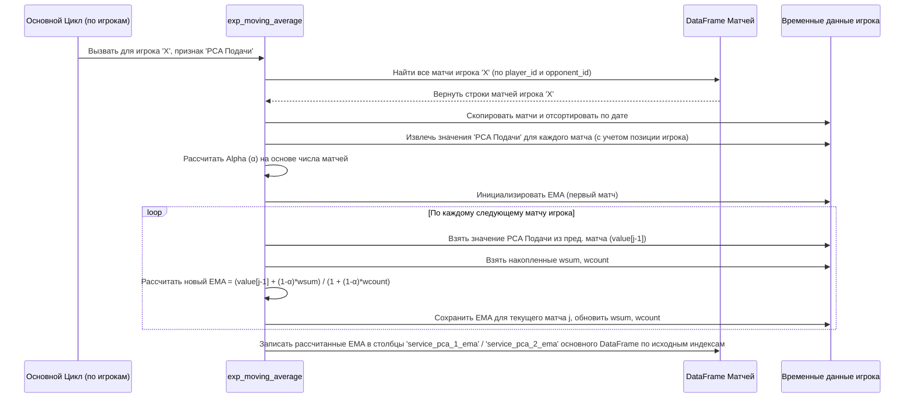

# Chapter 5: Скользящее среднее (EMA) для формы игрока


В [предыдущей главе](04_оценка_производительности_и_h2h_.md) мы научились рассчитывать два важных показателя: **оценку производительности**, которая показывает, насколько хорошо игрок выступил в *конкретном матче* по сравнению с ожиданиями, и **баланс личных встреч (H2H)**. Оценка производительности дает нам мгновенный снимок, но один матч, хороший или плохой, не всегда отражает реальную форму игрока. Игрок мог случайно выиграть или проиграть.

**Проблема:** Как нам получить более стабильную и надежную оценку *текущей формы* игрока, которая учитывает не только последний матч, но и несколько предыдущих, при этом придавая больший вес самым свежим результатам?

**Решение:** Мы будем использовать **Экспоненциальное Скользящее Среднее (EMA - Exponential Moving Average)**.

Представьте, что вы следите за успехами студента. Его последняя оценка важна, но чтобы понять его текущую успеваемость, вы смотрите на несколько последних оценок, причем недавние контрольные влияют на ваше мнение больше, чем оценки за прошлый семестр. EMA работает похожим образом для оценки формы теннисиста.

**Цель этой главы:** Понять, что такое EMA, почему оно полезно для оценки формы теннисиста, и как оно рассчитывается и применяется в нашем проекте к таким показателям, как [PCA-рейтинги](03_создание_признаков_и_pca_.md) или [оценка производительности](04_оценка_производительности_и_h2h_.md).

## Что такое Экспоненциальное Скользящее Среднее (EMA)?

**Скользящее среднее** — это способ вычислить среднее значение какого-либо показателя (например, цены акции, температуры или, в нашем случае, рейтинга подачи игрока) за определенный период времени. Простое скользящее среднее (SMA) берет, скажем, 10 последних значений и делит их сумму на 10. Все значения имеют одинаковый вес.

**Экспоненциальное Скользящее Среднее (EMA)** — это более хитрый вид скользящего среднего. Ключевое отличие: **EMA придает больше веса самым свежим данным**. Чем старее данные, тем меньше их влияние на итоговое среднее значение.

**Аналогия со студентом:**
*   **Простое среднее (SMA):** Средний балл за весь год. Все оценки одинаково важны.
*   **Экспоненциальное среднее (EMA):** Оценка текущей формы. Последняя контрольная важнее контрольной месяц назад, а та, в свою очередь, важнее экзамена полгода назад. EMA плавно "забывает" старую информацию.

**Как это работает (идея):**
EMA рассчитывается итеративно (шаг за шагом). Для каждого нового матча игрока его новый EMA зависит от:
1.  Значения показателя в этом **новом матче** (например, PCA-рейтинг подачи в этом матче).
2.  **Предыдущего значения EMA** (рассчитанного для матча до этого).

Формула выглядит примерно так:

`Новый_EMA = (Значение_сегодня * α) + (Предыдущий_EMA * (1 - α))`

Где:
*   `α` (альфа) — это **коэффициент сглаживания** (небольшое число от 0 до 1). Он определяет, насколько сильное влияние оказывает самое свежее значение. Чем больше `α`, тем быстрее EMA реагирует на изменения и тем больше вес у последнего значения.

В нашем проекте `α` не фиксирован, а зависит от количества матчей, сыгранных игроком (`m`): `α = 2 / (m + 1)`. Это означает, что для новичков (мало матчей, `m` маленькое) `α` будет больше, и их EMA будет быстрее меняться. Для опытных игроков (много матчей, `m` большое) `α` будет меньше, и их EMA будет более стабильным.

## Зачем EMA в теннисе?

Форма теннисистов постоянно меняется. Травмы, усталость, смена покрытия, удачные или неудачные серии — всё это влияет на их игру. Показатели, рассчитанные для одного матча (например, [PCA-рейтинги подачи/приема](03_создание_признаков_и_pca_.md) или [оценка производительности](04_оценка_производительности_и_h2h_.md)), могут сильно "скакать" от матча к матчу.

EMA помогает **сгладить** эти колебания и получить более устойчивую оценку недавней формы игрока в конкретном аспекте игры. Если игрок провел несколько сильных матчей подряд, его EMA по этому показателю будет расти. Если он начал играть хуже, EMA будет постепенно снижаться.

В нашем проекте EMA рассчитывается для:
*   PCA-рейтингов подачи (`service_pca_1_ema`, `service_pca_2_ema`)
*   PCA-рейтингов приема (`return_pca_1_ema`, `return_pca_2_ema`)
*   PCA-рейтингов ошибок на подаче (`errors_pca_1_ema`, `errors_pca_2_ema` - рассчитывается в `Feature_Extraction_Mistakes_on_Service.py`)
*   Оценок производительности (`performance_1_ema`, `performance_2_ema` - рассчитывается в `Feature_Extraction_Performance.py`)

Эти сглаженные показатели (`_ema`) дадут нашей будущей модели более надежную информацию о текущем состоянии игроков перед матчем.

## Как рассчитывается EMA в проекте

Расчет EMA выполняется для каждого игрока и для каждого показателя отдельно. Основная логика реализована в функции `exp_moving_average` в файлах `Exponential_Moving_Average.py`, `Feature_Extraction_Mistakes_on_Service.py` и `Feature_Extraction_Performance.py`.

**Шаг 1: Сбор данных игрока**
Для конкретного игрока (например, Роджера Федерера) и конкретного показателя (например, PCA-рейтинга подачи `service_pca`) функция сначала находит все матчи этого игрока в DataFrame, отсортированные по дате. Она также извлекает значения нужного показателя из этих матчей.

```python
# Пример: Найти все матчи Роджера Федерера
player = 'roger-federer'
# temp - временный DataFrame только с матчами Федерера
temp = matches_df.loc[(matches_df['player_id']==player) | (matches_df['opponent_id']==player)].copy()
temp.sort_values(by='start_date', inplace=True) # Убедимся, что отсортированы
temp.reset_index(inplace=True) # Сбросим индекс для удобства

# orig_index - сохраняем исходные индексы из matches_df
orig_index = temp['index']

# Далее, код извлекает значения 'service_pca_1' (если Федерер был player_id)
# или 'service_pca_2' (если Федерер был opponent_id) для каждого матча.
# (В реальной функции используется словарь 'aa' для хранения значений и их индексов)
print(f"Найдены матчи для игрока: {player}")
```

**Шаг 2: Расчет Alpha (α)**
Вычисляется коэффициент сглаживания `alpha = 2 / (N + 1)`, где `N` — общее количество найденных матчей для этого игрока (по которым есть данные для расчета EMA).

```python
# N - количество матчей игрока с нужными данными (из словаря 'aa' в функции)
N = len(aa) # aa - словарь со значениями показателя для игрока
alpha = 2 / (N + 1)
factor = 1 - alpha # Коэффициент для предыдущего EMA

print(f"Коэффициент сглаживания alpha: {alpha:.4f}")
```

**Шаг 3: Итеративный расчет EMA**
Функция проходит по всем матчам игрока (начиная со второго). Для каждого матча `j` она вычисляет EMA, используя значение показателя из предыдущего матча (`j-1`) и предыдущее накопленное EMA.

```python
# Упрощенная идея цикла расчета EMA
# bb - список значений показателя игрока из матчей
# cc - список ключей (индекс + 'a'/'b') из словаря 'aa'
bb = list(aa.values())
cc = list(aa.keys())

ema_values = {} # Словарь для хранения рассчитанных EMA
previous_ema = bb[0] # Начинаем с первого значения

for j in range(1, len(bb)):
    current_value = bb[j]
    # Формула EMA (немного отличается от классической, но дает похожий результат)
    # В коде используется взвешенная сумма и счетчик весов (wsum, wcount)
    # Упрощенная формула для понимания:
    # current_ema = alpha * current_value + (1 - alpha) * previous_ema
    # Вместо этого, код делает:
    wsum = bb[j-1] + factor * wsum # Накапливаем взвешенную сумму предыдущих
    wcount = 1 + factor * wcount     # Накапливаем сумму весов
    current_ema = wsum / wcount      # Рассчитываем среднее

    # Сохраняем EMA для текущего матча j (используя ключ из cc)
    ema_values[cc[j]] = current_ema
    # Обновляем previous_ema для следующей итерации (в коде это неявно через wsum)
    # previous_ema = current_ema # Для упрощенной формулы

print("EMA рассчитано для всех матчей игрока.")
```
*Важно: Реальная формула в коде использует `wsum` и `wcount` для более точного расчета взвешенного среднего по мере добавления новых точек. Идея та же: последние точки вносят больший вклад.*

**Шаг 4: Запись результатов в DataFrame**
Рассчитанные значения EMA записываются обратно в основной `matches_df` в соответствующие строки (используя сохраненные `orig_index`) и в новые столбцы (например, `service_pca_1_ema` или `service_pca_2_ema`, в зависимости от того, был ли игрок `player_id` или `opponent_id`).

```python
# Записываем рассчитанные EMA обратно в основной DataFrame
# dest_col1 = 'service_pca_1_ema', dest_col2 = 'service_pca_2_ema'
for key, value in ema_values.items():
    original_idx = int(key[:-1]) # Получаем исходный индекс матча
    player_pos = key[-1]         # 'a' если был player_1, 'b' если player_2

    if player_pos == 'a':
        matches_df.at[original_idx, dest_col1] = value
    elif player_pos == 'b':
        matches_df.at[original_idx, dest_col2] = value

print(f"Значения EMA записаны в столбцы {dest_col1} и {dest_col2}.")
```

**Шаг 5: Повторение для всех игроков и всех показателей**
Весь этот процесс (шаги 1-4) повторяется в цикле для каждого игрока из списка `players` и для каждой пары показателей, для которых нужно рассчитать EMA (PCA подачи, PCA приема и т.д.).

```python
# Пример основного цикла из Exponential_Moving_Average.py
players = get_player_list(matches_df) # Получаем список всех игроков

# Создаем пустые столбцы для EMA
matches_df['service_pca_1_ema'] = None
matches_df['service_pca_2_ema'] = None
matches_df['return_pca_1_ema'] = None
matches_df['return_pca_2_ema'] = None

print("Начинаем расчет EMA для PCA подачи...")
i = 0
for plyr in players:
    # Вызываем функцию для расчета EMA PCA подачи для текущего игрока
    exp_moving_average(matches_df, plyr,
                       'service_pca_1', 'service_pca_2',
                       'service_pca_1_ema', 'service_pca_2_ema')
    i += 1
    if i % 100 == 0: # Печатаем прогресс каждые 100 игроков
        print(f'Расчет PCA подачи: обработано {i} из {len(players)} игроков')

print("\nНачинаем расчет EMA для PCA приема...")
j = 0
for plyr in players:
    # Вызываем функцию для расчета EMA PCA приема для текущего игрока
    exp_moving_average(matches_df, plyr,
                       'return_pca_1', 'return_pca_2',
                       'return_pca_1_ema', 'return_pca_2_ema')
    j += 1
    if j % 100 == 0:
        print(f'Расчет PCA приема: обработано {j} из {len(players)} игроков')

print("\nРасчет EMA завершен.")
```

## Визуализация процесса расчета EMA

Представим, как функция `exp_moving_average` работает для одного игрока и одного показателя:



## Обработка пропусков (NaN)

После основного расчета EMA некоторые ячейки могут остаться пустыми (`NaN`). Это может произойти для самых первых матчей игрока, где EMA еще не было рассчитано. Чтобы заполнить эти пропуски, используется функция `get_nans` (и вспомогательная `get_last_ema`).

**Идея:** Для каждой ячейки с пропущенным EMA (`NaN`) функция ищет *назад* по матчам этого же игрока до тех пор, пока не найдет самое последнее *непропущенное* значение EMA. Затем это найденное значение используется для заполнения пропуска. Если предыдущих значений нет (например, самый первый матч в базе данных), пропуск может остаться (или заполниться нулем).

```python
# Пример вызова функции заполнения пропусков после расчета EMA
# (Код функций get_nans и get_last_ema есть в скриптах)
print("Заполнение пропущенных значений EMA...")
i = 0
for player in players:
    # Заполняем NaN для EMA PCA подачи
    get_nans(player, matches_df, 'service_pca_1_ema', 'service_pca_2_ema')
    # Заполняем NaN для EMA PCA приема
    get_nans(player, matches_df, 'return_pca_1_ema', 'return_pca_2_ema')
    # ... (и для других EMA) ...
    i += 1
    if i % 100 == 0:
        print(f'Заполнение NaN: обработано {i} из {len(players)} игроков')

print("Заполнение пропусков EMA завершено.")
```

## Заключение

В этой главе мы разобрались с Экспоненциальным Скользящим Средним (EMA):

*   **Что это:** Метод расчета среднего, который придает больший вес недавним данным, плавно "забывая" старые.
*   **Зачем это нужно:** Чтобы получить сглаженную и более стабильную оценку текущей формы игрока по различным показателям (PCA подачи/приема, ошибки, производительность), чем оценка по одному матчу.
*   **Как это реализовано:** Через итеративный расчет для каждого игрока и каждого показателя, с использованием коэффициента сглаживания `alpha`, зависящего от опыта игрока.

Теперь наш DataFrame `matches_df` содержит не только "мгновенные" показатели матчей, но и их сглаженные версии (`_ema`), отражающие недавние тенденции в игре каждого теннисиста. Эти EMA-признаки будут очень важны для нашей модели машинного обучения.

Мы почти завершили подготовку данных! Собрав все эти признаки — от базовой статистики и [рейтингов ELO](02_расчет_рейтинга_elo_.md) до [PCA-рейтингов](03_создание_признаков_и_pca_.md), [оценок производительности и H2H](04_оценка_производительности_и_h2h_.md), и теперь их EMA — мы готовы перейти к самому интересному: обучению модели, которая будет использовать эти данные для прогнозирования исходов матчей.

**Далее:** [Глава 6: Обучение модели и прогнозирование](06_обучение_модели_и_прогнозирование_.md)

---

Generated by [AI Codebase Knowledge Builder](https://github.com/The-Pocket/Tutorial-Codebase-Knowledge)