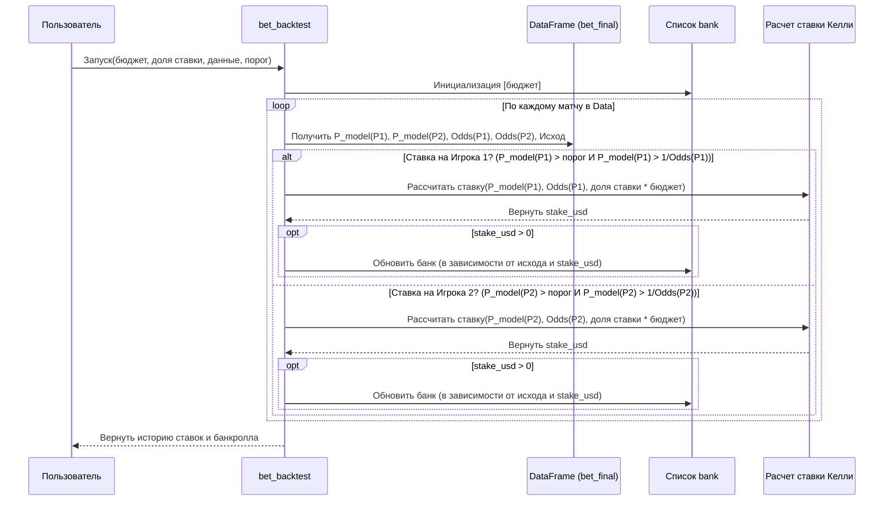

# Chapter 7: Симуляция ставок


В [предыдущей главе](06_обучение_модели_и_прогнозирование_.html) мы прошли долгий путь: подготовили данные, рассчитали множество признаков и, наконец, обучили модель машинного обучения — Логистическую Регрессию. Эта модель теперь умеет анализировать характеристики предстоящего теннисного матча и выдавать **вероятность победы** для каждого из игроков.

Но что делать с этими вероятностями? Сами по себе они интересны, но как понять, можно ли их использовать для принятия прибыльных решений, например, в ставках на спорт? Просто высокая точность (accuracy) модели не гарантирует прибыль, так как коэффициенты букмекеров уже учитывают шансы игроков.

**Проблема:** Как проверить, могла бы стратегия, основанная на прогнозах нашей модели, быть прибыльной в реальном мире, не рискуя настоящими деньгами?

**Решение:** Мы проведем **симуляцию ставок** на исторических данных. Мы возьмем прогнозы нашей модели для прошедших матчей (из тестовой выборки) и сравним их с реальными коэффициентами букмекеров на те же матчи. Если наша модель оценивает шансы игрока выше, чем букмекер (и достаточно уверенно), мы сделаем *виртуальную* ставку. Проделав это для множества матчей, мы увидим, как изменялся бы наш виртуальный банкролл.

**Аналогия:** Представьте, что вы разработали новую торговую стратегию для фондового рынка. Прежде чем вкладывать реальные деньги, вы протестируете ее на исторических данных котировок акций, чтобы увидеть, принесла бы она прибыль в прошлом. Симуляция ставок — это точно такой же "тест-драйв" для нашей модели прогнозирования.

**Цель этой главы:** Понять, как использовать вероятности, предсказанные моделью, для имитации процесса ставок, сравнить их с коэффициентами букмекеров и оценить потенциальную прибыльность стратегии на основе модели.

## Ключевые концепции симуляции ставок

Чтобы провести симуляцию, нам нужно разобраться с несколькими идеями:

1.  **Ставки на основе стоимости (Value Betting):** Это краеугольный камень прибыльных ставок. Идея в том, чтобы ставить только тогда, когда вы считаете, что вероятность события *выше*, чем та, которую подразумевает коэффициент букмекера.
    *   **Вероятность модели (`P_model`):** Это вероятность победы игрока, которую предсказала наша модель (например, 0.65, или 65%).
    *   **Подразумеваемая вероятность букмекера (`P_bookie`):** Букмекер предлагает коэффициент (например, 1.80). Этот коэффициент можно перевести в вероятность: `P_bookie = 1 / коэффициент`. Например, коэффициент 1.80 означает `P_bookie = 1 / 1.80 ≈ 0.556` (или 55.6%).
    *   **Условие для ставки:** Мы делаем ставку на игрока, только если `P_model` *существенно выше*, чем `P_bookie`. Например, если наша модель дает 65%, а букмекер — 55.6%, мы нашли "ценность" (value).

2.  **Коэффициенты букмекера (Bookmaker Odds):** Это числа, которые показывают, какой выигрыш вы получите, если ваша ставка сыграет.
    *   **Десятичные коэффициенты (Decimal Odds):** Формат, используемый в Европе и в нашем проекте (например, 1.50, 2.10, 3.00). Если вы ставите 100 рублей на коэффициент 2.10 и выигрываете, вы получаете обратно 100 * 2.10 = 210 рублей (включая вашу ставку, т.е. чистый выигрыш 110 рублей).
    *   **Преобразование в вероятность:** `Вероятность = 1 / Коэффициент`. (Важно: букмекеры закладывают свою маржу, поэтому сумма вероятностей для всех исходов матча будет больше 1).

3.  **Порог уверенности (`p`):** Мы не хотим ставить на каждое небольшое расхождение между нашей моделью и букмекером. Может быть, модель немного ошиблась, или это случайность. Поэтому мы вводим **порог уверенности** (в коде это переменная `p`, например, 0.6 или 0.7). Мы делаем ставку, только если `P_model` не только больше `P_bookie`, но и больше этого порога `p`. Это помогает отсеять неуверенные прогнозы.

4.  **Управление банкроллом / Размер ставки (Staking Strategy):** Крайне важно не ставить весь свой банк (бюджет) на один матч. Нужно определить, какую часть банкролла ставить на каждое событие.
    *   **Фиксированная ставка:** Ставить всегда одинаковую сумму (например, 1% от начального банкролла).
    *   **Критерий Келли (Kelly Criterion):** Более сложная стратегия (используется в нашем скрипте `Training.py`). Она рассчитывает оптимальный размер ставки как долю от текущего банкролла, основываясь на вашем "преимуществе" (насколько `P_model` выше `P_bookie`) и коэффициенте. Идея в том, чтобы ставить больше, когда вы более уверены в своем преимуществе, и меньше (или вообще не ставить), когда преимущество невелико или отсутствует. В нашем коде размер ставки еще дополнительно масштабируется параметром `stake` (например, 0.1), чтобы сделать стратегию менее агрессивной.

## Процесс симуляции ставок

Теперь посмотрим, как это реализовано в коде (в конце скрипта `Training.py`).

### Шаг 1: Подготовка данных для симуляции

Нам нужны данные, содержащие как прогнозы нашей модели, так и реальные коэффициенты букмекеров для тех же матчей.

```python
# Загружаем данные с коэффициентами букмекеров
# (Предполагается, что файл содержит колонки: start_date, player_id, opponent_id, odds1, odds2)
odds_df = pd.read_csv('betting_moneyline.csv', parse_dates=['start_date'])

# Фильтруем коэффициенты, чтобы они соответствовали временному периоду тестовой выборки
# (В оригинальном коде берется дата >= '2015-04-06', которая соответствует началу тестовой выборки)
odds_df = odds_df.loc[odds_df['start_date'] >= '2015-04-06'].copy() # Пример даты

# Создаем DataFrame 'bet', содержащий ID игроков, дату, истинный исход (player_1_v)
# и вероятности от модели (proba_0, proba_1) для ТЕСТОВОЙ выборки.
# Этот DataFrame 'bet' был создан ранее в скрипте Training.py
# на основе x_test и предсказаний best_model.predict_proba()
# bet['proba_0'] = prob[:,0] # Вероятность победы игрока 2
# bet['proba_1'] = prob[:,1] # Вероятность победы игрока 1

# Переименовываем колонки в odds_df для соответствия (если нужно)
# odds_df.rename(columns={'team1':'player_id', 'team2':'opponent_id'}, inplace=True)

# Объединяем прогнозы модели с коэффициентами букмекеров
# Ключи для объединения: дата, ID игрока 1, ID игрока 2
bet_final = bet.merge(odds_df[['start_date', 'player_id', 'opponent_id', 'odds1', 'odds2']],
                      on=['start_date', 'player_id', 'opponent_id'])

# Удаляем возможные дубликаты, если один и тот же матч записан несколько раз
bet_final.drop_duplicates(subset=['player_id', 'opponent_id', 'start_date'], inplace=True)

print("Данные, готовые для симуляции (первые строки):")
print(bet_final[['start_date', 'player_id', 'opponent_id', 'player_1_v', 'proba_1', 'odds1', 'odds2']].head())
```

**Объяснение:**
*   Мы загружаем файл с историческими коэффициентами (`betting_moneyline.csv`).
*   Фильтруем его, чтобы оставить только те матчи, которые входят в нашу тестовую выборку (по дате).
*   Используем DataFrame `bet`, который уже содержит прогнозы нашей модели (`proba_0`, `proba_1`) и фактические исходы (`player_1_v`) для тестовых матчей.
*   С помощью `pd.merge` мы "склеиваем" прогнозы модели и коэффициенты букмекеров по общим ключам: дата и ID игроков.
*   Теперь в `bet_final` у нас есть вся информация для каждого матча: кто играл, когда, кто реально выиграл, что предсказала модель (вероятности) и какие были коэффициенты.

### Шаг 2: Функция симуляции `bet_backtest`

Эта функция принимает начальный бюджет, долю для расчета ставки по Келли, DataFrame с данными и порог уверенности, а затем имитирует процесс ставок.

```python
# Упрощенная версия функции для наглядности
def bet_backtest(budget, stake_fraction, data, probability_threshold):
    bank = [budget] # Список для хранения истории банкролла
    bets_count = [0] # Список для номеров ставок
    
    initial_stake_base = stake_fraction * budget # База для расчета ставки Келли
    
    k = 0 # Счетчик сделанных ставок
    bets_won = 0
    bets_lost = 0

    # Проходим по каждому матчу в тестовых данных с коэффициентами
    for i in range(len(data)):
        model_prob_p1 = data.iloc[i]['proba_1'] # Вероятность победы Игрока 1 от модели
        model_prob_p2 = data.iloc[i]['proba_0'] # Вероятность победы Игрока 2 от модели
        odds_p1 = data.iloc[i]['odds1'] # Коэффициент на Игрока 1
        odds_p2 = data.iloc[i]['odds2'] # Коэффициент на Игрока 2
        actual_outcome_p1 = data.iloc[i]['player_1_v'] # Реальный исход (1 если П1 выиграл, 0 если П2)

        # Условие 1: Ставка на Игрока 1?
        # Проверяем: Вероятность модели > порога И Вероятность модели > подразумеваемой букмекером
        if (model_prob_p1 > probability_threshold) and (model_prob_p1 > (1 / odds_p1)):
            # Рассчитываем размер ставки (упрощенный Келли)
            # Чем выше model_prob_p1 по сравнению с 1/odds_p1, тем больше ставка
            try:
                # Формула Келли (fraction * edge / odds), где edge = P_model * odds - 1
                edge = model_prob_p1 * odds_p1 - 1
                kelly_fraction = edge / (odds_p1 - 1)
                stake_usd = initial_stake_base * kelly_fraction # Масштабируем долей от бюджета
                
                if stake_usd <= 0: continue # Не ставим, если Келли не рекомендует

                # Делаем виртуальную ставку
                k += 1 
                if actual_outcome_p1 == 1: # Ставка выиграла
                    profit = stake_usd * odds_p1 - stake_usd
                    bank.append(bank[-1] + profit) # Увеличиваем банкролл
                    bets_won += 1
                else: # Ставка проиграла
                    bank.append(bank[-1] - stake_usd) # Уменьшаем банкролл
                    bets_lost += 1
                bets_count.append(k)
            except ZeroDivisionError: # Если odds_p1 == 1 (редко, но возможно)
                continue

        # Условие 2: Ставка на Игрока 2?
        elif (model_prob_p2 > probability_threshold) and (model_prob_p2 > (1 / odds_p2)):
            # Аналогичный расчет ставки и обновление банкролла
            try:
                edge = model_prob_p2 * odds_p2 - 1
                kelly_fraction = edge / (odds_p2 - 1)
                stake_usd = initial_stake_base * kelly_fraction

                if stake_usd <= 0: continue
                
                k += 1
                if actual_outcome_p1 == 0: # Ставка выиграла (т.к. P1 проиграл)
                    profit = stake_usd * odds_p2 - stake_usd
                    bank.append(bank[-1] + profit)
                    bets_won += 1
                else: # Ставка проиграла
                    bank.append(bank[-1] - stake_usd)
                    bets_lost += 1
                bets_count.append(k)
            except ZeroDivisionError:
                continue

    print(f"Всего ставок: {k}, Выиграно: {bets_won}, Проиграно: {bets_lost}")
    return bets_count, bank

```

**Объяснение:**
1.  **Инициализация:** Создаем списки `bank` (для истории бюджета) и `bets_count` (для оси X графика), начинаем с начального `budget` и 0 ставок. Рассчитываем `initial_stake_base` для формулы Келли.
2.  **Цикл по матчам:** Проходим по каждому матчу в `data` (`bet_final`).
3.  **Проверка условий:** Для каждого игрока (сначала P1, потом P2) проверяем два условия:
    *   Вероятность от модели (`model_prob_p1` или `model_prob_p2`) больше порога уверенности (`probability_threshold`).
    *   Вероятность от модели больше подразумеваемой вероятности букмекера (`1 / odds_p1` или `1 / odds_p2`).
4.  **Расчет ставки (Келли):** Если оба условия выполнены, рассчитываем размер ставки с помощью критерия Келли. `edge` показывает наше преимущество. `kelly_fraction` - оптимальная доля банкролла для ставки. Мы умножаем ее на `initial_stake_base`, чтобы получить сумму ставки в долларах/рублях. Если Келли рекомендует не ставить (`stake_usd <= 0`), переходим к следующему матчу.
5.  **Виртуальная ставка:** Увеличиваем счетчик ставок `k`.
6.  **Обновление банкролла:** Проверяем реальный исход матча (`actual_outcome_p1`).
    *   Если ставка выиграла, добавляем чистый выигрыш (`stake_usd * odds - stake_usd`) к последнему значению в `bank`.
    *   Если ставка проиграла, вычитаем сумму ставки (`stake_usd`) из последнего значения в `bank`.
7.  **Возврат результатов:** Функция возвращает историю изменения номеров ставок и банкролла.

### Шаг 3: Запуск симуляции и анализ результатов

Вызываем функцию `bet_backtest` с выбранными параметрами и строим график изменения банкролла.

```python
import matplotlib.pyplot as plt

# Запускаем симуляцию
# budget=1000: начальный банкролл
# stake=0.1: доля от бюджета для базы Келли (10%)
# data=bet_final: наши данные с прогнозами и кэфами
# p=0.9: порог уверенности (ставим только если модель > 90% уверена и это > кэфа)
# ВАЖНО: p=0.9 - очень высокий порог, ставок будет мало. В реальном анализе подбирают оптимальный p.
bets, bank = bet_backtest(budget=1000, stake_fraction=0.1, data=bet_final, probability_threshold=0.9)

# Строим график
plt.figure(figsize=(10, 6))
plt.plot(bets, bank)
plt.xlabel("Количество ставок")
plt.ylabel("Размер банкролла")
plt.title("Симуляция ставок (Бэктест) | Порог = 0.9, Доля ставки = 0.1")
plt.grid(True)
plt.show()

# Можно попробовать с другими параметрами, например, с меньшим порогом
# bets_p07, bank_p07 = bet_backtest(1000, 0.1, bet_final, 0.7)
# plt.plot(bets_p07, bank_p07, label='Порог = 0.7')
# plt.legend()
# plt.show()
```

**Интерпретация графика:**
*   **Ось X:** Количество сделанных виртуальных ставок.
*   **Ось Y:** Размер виртуального банкролла после каждой ставки.
*   **Тенденция графика:**
    *   **Рост:** Стратегия была бы прибыльной на этих исторических данных с данными параметрами.
    *   **Падение:** Стратегия была бы убыточной.
    *   **Колебания:** Нормальное явление, показывает риски и дисперсию.

**Важно:** Результат симуляции сильно зависит от выбранных параметров (`stake_fraction`, `probability_threshold`). Необходимо экспериментировать с разными значениями, чтобы найти оптимальную стратегию. Также важно помнить, что прошлые результаты не гарантируют будущую прибыль.

## Внутренняя логика симуляции (Диаграмма)



**Пояснение диаграммы:**
1.  Пользователь запускает `bet_backtest`.
2.  Функция инициализирует историю банкролла.
3.  Для каждого матча она получает прогнозы модели, коэффициенты и реальный исход.
4.  Проверяет условия для ставки на Игрока 1 или Игрока 2 (сравнение вероятностей модели с порогом и подразумеваемой вероятностью букмекера).
5.  Если условия выполнены, вызывает модуль расчета ставки по Келли.
6.  Если Келли рекомендует ставить (`stake_usd > 0`), обновляет историю банкролла в зависимости от того, выиграла виртуальная ставка или проиграла.
7.  После обработки всех матчей возвращает результат пользователю.

## Заключение

В этой заключительной главе мы замкнули цикл нашего проекта:

*   Мы поняли, зачем нужна **симуляция ставок**: чтобы оценить практическую ценность прогнозов модели без риска реальными деньгами.
*   Мы изучили ключевые концепции: **ставки на основе стоимости (value betting)**, сравнение вероятностей модели и букмекера, **порог уверенности** и **управление банкроллом** (Критерий Келли).
*   Мы увидели, как объединить прогнозы модели с историческими **коэффициентами букмекеров**.
*   Мы разобрали функцию `bet_backtest`, которая имитирует процесс ставок на основе заданных правил.
*   Мы научились **интерпретировать результаты** симуляции (график изменения банкролла).

Симуляция ставок — это мощный инструмент для оценки любой прогнозирующей модели в контексте реального применения. Она позволяет не только увидеть потенциальную прибыльность, но и подобрать оптимальные параметры для стратегии ставок (порог уверенности, размер ставки).

На этом наше руководство по проекту `Tennis-Betting-ML` завершается. Мы прошли путь от сбора и [предобработки данных](01_предобработка_и_сбор_данных_.html), расчета [рейтинга ELO](02_расчет_рейтинга_elo_.html), создания [сложных признаков и PCA](03_создание_признаков_и_pca_.html), оценки [производительности и H2H](04_оценка_производительности_и_h2h_.html), использования [EMA для формы игрока](05_скользящее_среднее__ema__для_формы_игрока_.html) до [обучения модели](06_обучение_модели_и_прогнозирование_.html) и, наконец, практической проверки ее результатов через **симуляцию ставок**. Надеемся, это путешествие было полезным и познавательным!

---