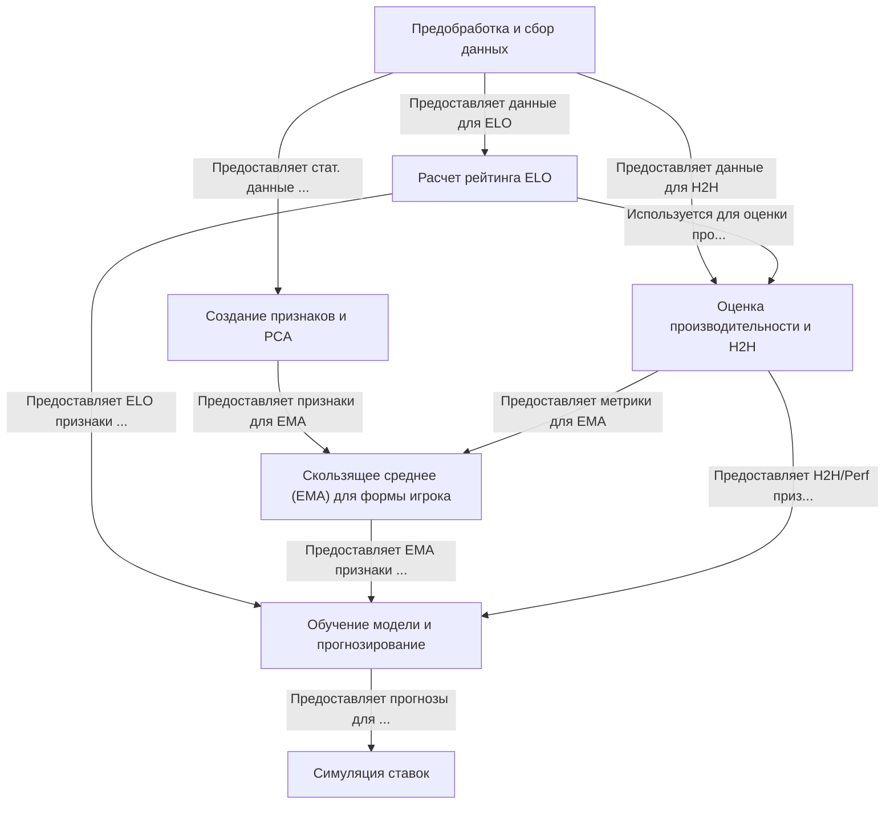

# Tutorial: Tennis-Betting-ML

Этот проект использует **машинное обучение** для прогнозирования результатов теннисных матчей.
Он начинает с *обработки* большого объема данных о прошлых играх и игроках, затем рассчитывает рейтинг силы (*ELO*) для каждого.
Далее создаются *специальные признаки*, отражающие статистику подачи, приема и недавнюю форму игроков (с помощью EMA).
На основе этих данных **обучается модель**, которая предсказывает вероятность победы одного игрока над другим.
В конце проводится *симуляция ставок*, чтобы проверить, могла ли стратегия, основанная на прогнозах модели, быть прибыльной.

**Source Repository:** [https://github.com/BrandoPolistirolo/Tennis-Betting-ML](https://github.com/BrandoPolistirolo/Tennis-Betting-ML)

## Chapters

1. [Предобработка и сбор данных
](01_предобработка_и_сбор_данных_.md)
2. [Расчет рейтинга ELO
](02_расчет_рейтинга_elo_.md)
3. [Создание признаков и PCA
](03_создание_признаков_и_pca_.md)
4. [Оценка производительности и H2H
](04_оценка_производительности_и_h2h_.md)
5. [Скользящее среднее (EMA) для формы игрока
](05_скользящее_среднее__ema__для_формы_игрока_.md)
6. [Обучение модели и прогнозирование
](06_обучение_модели_и_прогнозирование_.md)
7. [Симуляция ставок
](07_симуляция_ставок_.md)

---

Generated by [AI Codebase Knowledge Builder](https://github.com/The-Pocket/Tutorial-Codebase-Knowledge)